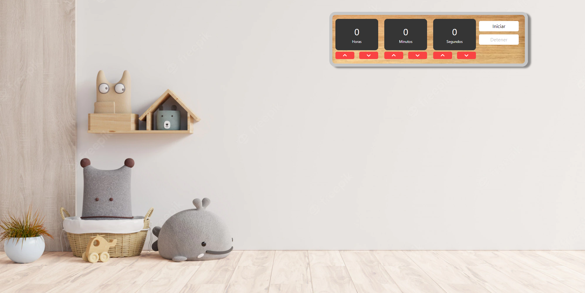

# Temporizador JS

Página web que simula un temporizador utilizando HTML, CSS, JavaScript y el framework de Bootstrap

    

        
    

## GitHub pages

* https://jonathan-yv.github.io/temporizador/

## Características
* API audio
* Horas, minutos y segundos

## Autor ✒️

* **Jonathan Yair Vazquez Uriostegui**